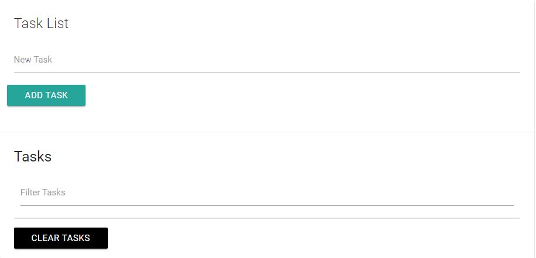
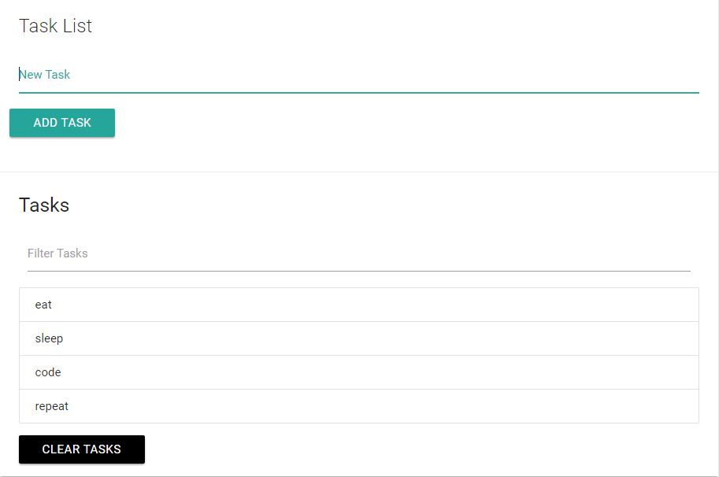

# TaskList
In this Task list project, you can add tasks, delete tasks, filter tasks and then persist/store them to your local storage.

<b>This is what it looks like on loading from your localhost</b>

<b>After adding some items</b>

<b>On filtering</b>

Added items are persisted to and fetched from local storage so they remain in the ui whenever the browser is reloaded.
